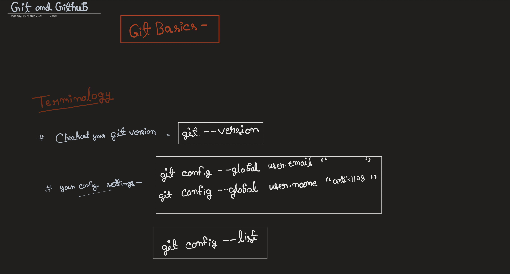
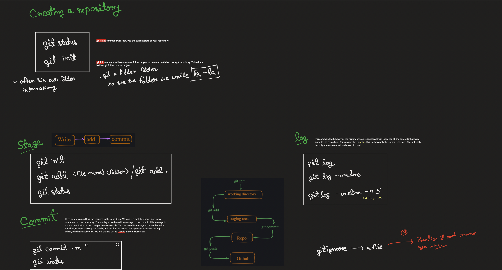
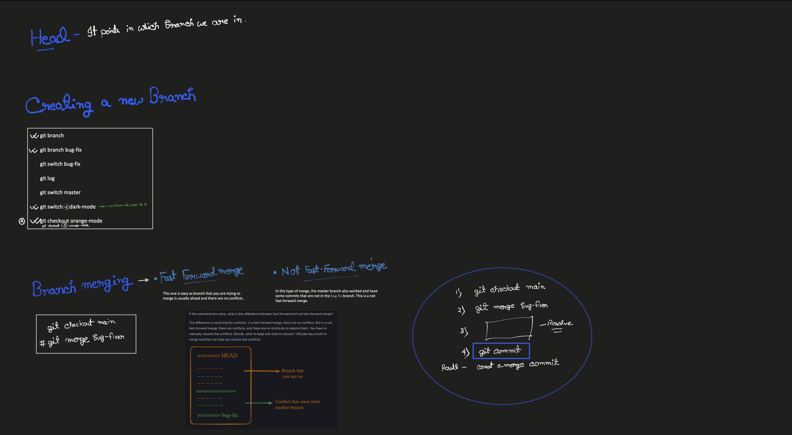
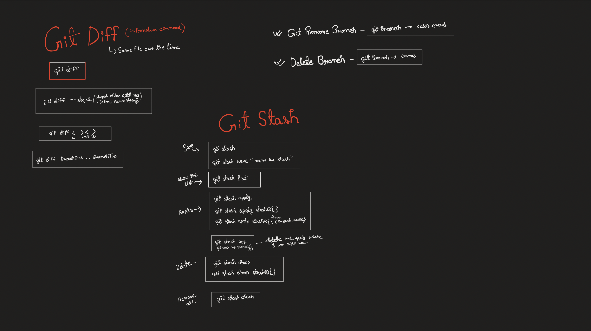
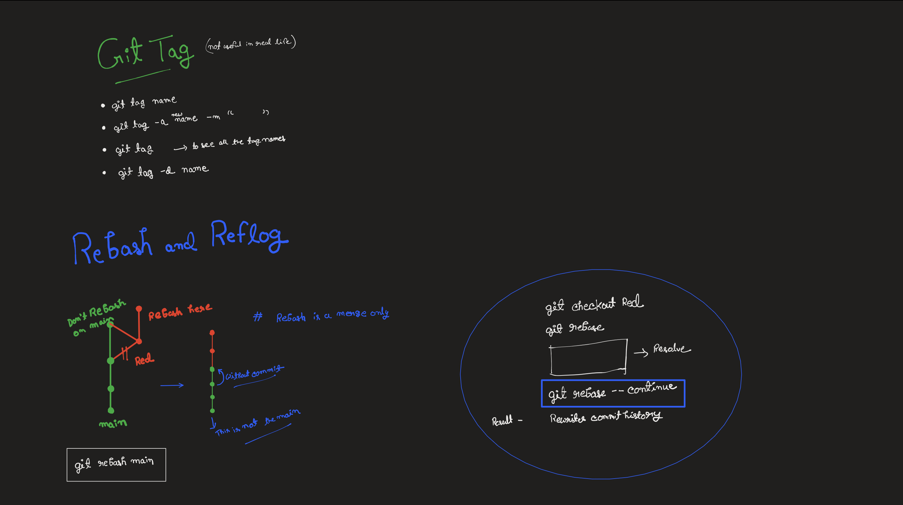
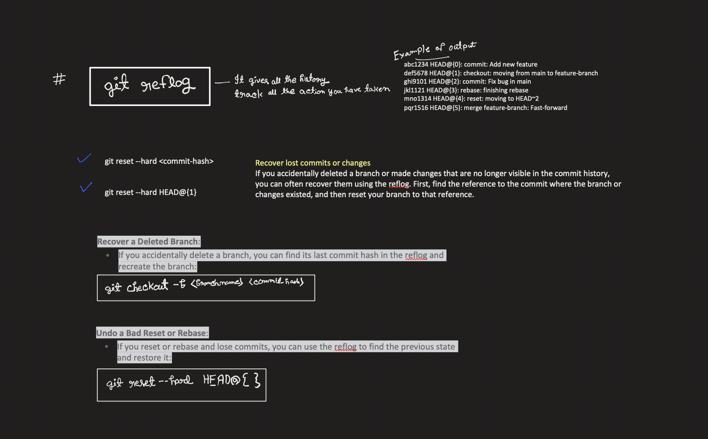
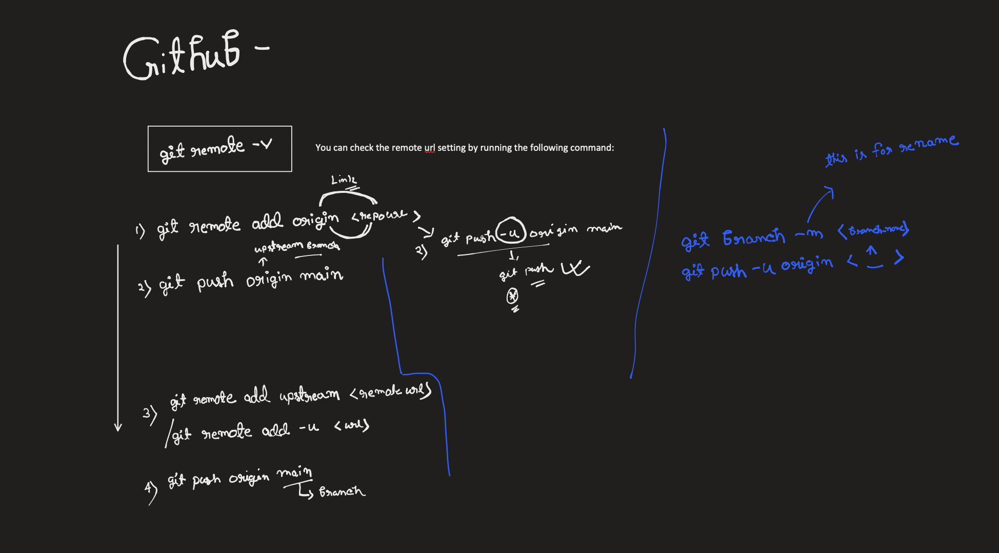

# Git Basics Notes

Welcome to this beginner-friendly guide to Git and GitHub using visual notes.This repository contains notes and examples for learning Git and GitHub fundamentals.

## Contents

- Basic Git commands
- Repository management
- Branching and merging
- Working with remotes
- Best practices

## Getting Started

This is a learning repository for Git basics. Feel free to explore the notes and practice with the examples provided.

## Contributing

This is a personal learning project, but suggestions and improvements are welcome!

## 📚 Illustrated Git Notes

| Concept | Image |
|--------|-------|
| Git Intro |  |
| Git Installation |  |
| Git Init & Config |  |
| Git Add & Commit |  |
| Git Status & Log |  |
| Git Branches |  |
| GitHub Push & Clone |  |

---

> ✨ These handwritten notes are aimed at beginners. If you're just starting out, this is for you!

